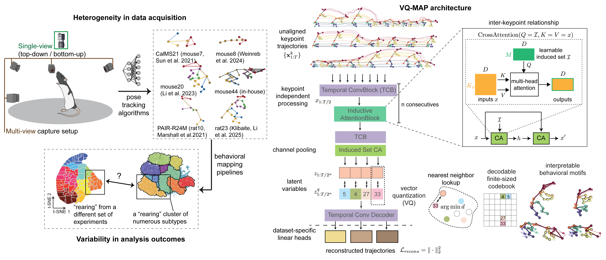

# VQ-MAP: a flexible, versatile framework for animal behavior understanding

<p align="center">
  
</p>

## Overview
The brain generates behaviors that reflect configurations and computations of neural systems. Animal pose analysis can comprehensively profile behaviors in terms of stereotyped action expression, but the absence of common tracking standards makes it difficult to relate measurements across labs and experiments, hindering data exchange and collective knowledge building. Here, we present **VQ-MAP**, a versatile approach capable of mapping 2D or 3D keypoint sequences with divergent pose formats into a common set of discrete behavioral motifs. VQ-MAP utilizes permutation-invariant attention blocks for keypoint-agnostic processing and a quantized latent space for fast, interpretable delineation of motifs organized into type-subtype hierarchies. We deployed VQ-MAP to align and harmonize heterogeneous pose datasets, co-profiling rodent behaviors in multiple species and models of autism. In longitudinal recordings of rat behavioral maturation, VQ-MAP revealed developmental trajectories connecting specific behaviors across periods of substantial bodily growth and change. By unifying heterogeneous behavioral measurements, our framework will accelerate neurobiological discovery and help the community exercise the full potential of large-scale behavioral datasets. 

## :rocket: Getting Started
Clone the repository:
```bash
git clone https://github.com/vqmap/vqmap.git
cd vqmap
```

Create a conda environment and install dependencies:
```bash
conda create -n vqmap python=3.10
conda activate vqmap
# assume you have CUDA 11.8 on a Linux machine
# replace accordingingly if different https://pytorch.org/get-started/previous-versions/
pip install torch==2.4.1 torchvision==0.19.1 torchaudio==2.4.1 --index-url https://download.pytorch.org/whl/cu118
pip install -e .
```

## :star: Quick demo
Download example data and model checkpoint from [here](https://duke.app.box.com/folder/333003183760?s=n9l5swmdbyg94z0o94meh1wv4bv1ao36) and unzip under the `demo` directory.

Open [`demo/run-inference.ipynb`](./demo/run-inference.ipynb) and get started!

For model training, please refer to [`demo/launch-train.py`](./demo/launch-train.py).

## :bulb: GUI usage
Start the GUI by:
```
python -m gui.main
```