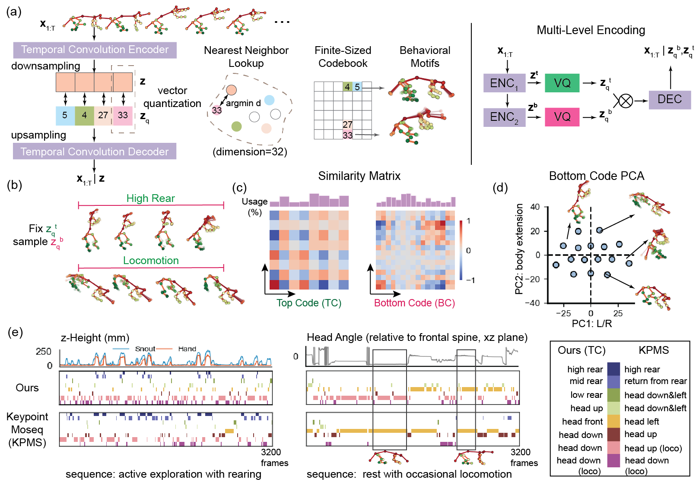

# Vector Quantized Representations for Efficient Hierarchical Delineation of Behavioral Repertoires

Code release for **Vector Quantized Representations for Efficient Hierarchical Delineation of Behavioral Repertoires**, accepted as poster in COSYNE 2024.

## Abstract
Understanding animal behaviors and their neural underpinnings requires precise kinematic measurements plus analytical methods to parse these continuous measurements into interpretable, organizational descriptions. Existing approaches, such as Markov models or clustering, can identify stereotyped behavioral motifs out of 2D or 3D keypoint-based data but are limited in their interpretability, computational efficiency, and/or ability to seamlessly integrate new measurements. Moreover, these methods lack the capacity for capturing the intrinsic hierarchy among identified behavioral motifs (e.g., ‘turning’ → subtypes of left/right turning with varying angles), necessitating subjective post hoc annotations by human labelers for grouping. 

In this paper, we propose an end-to-end generative behavioral analysis approach that dissects continuous body movements into sequences of discrete latent variables using multi-level vector quantization (VQ). The discrete latent space naturally defines an interpretable behavioral repertoire composed of hierarchically organized motifs, where the top-level latent codes govern coarse behavioral categories (e.g., rearing, locomotion) and the bottom-level codes control finer-scale kinematics features defining category subtypes (e.g., sidedness). Using 3D poses extracted from recordings of freely moving rodents (and humans), we show that the proposed framework faithfully supports standard behavioral analysis tasks while enabling new applications stemming from the discrete information bottleneck, including realistic synthesis of animal body movements and cross-species behavioral mapping.



## Environment Setup
```
conda create -n vqmap python=3.8
pip install torch==1.11.0+cu113 --extra-index-url https://download.pytorch.org/whl/cu111
pip install -r requirments.txt
pip install -e .
```

## Quick Start
1. Train a VQVAE on unannotated, continuous motion capture sequences.
```
python train.py configs/base/vqvae.yaml
```

2. Visualize the reconstruction quality and resulting latent space.
```
python inference.py [checkpoint-for-inference.pth] --mode all
```
This command will run the entire inference pipeline (VQ code extraction, visualization) automatically.

3. Train a motion code GPT.
```
python train.py configs/base/gpt.yaml
```

4. Generate random motion sequences and visualize:
```
python inference_gpt.py [checkpoint-for-inference.pth] --mode all
```

## Co-embed variable motion datasets
Leveraging the discrete bottleneck, we demonstrate how different motion datasets (e.g., rat, human) can be jointly embedded. Run the following for training such a model:
```
python train.py configs/base/vqvae_coemb.yaml
```

## Further Read
### Configuration System
The training configurations are indirectly specified by a master `.yaml` config file. Let's take a closer look at `configs/base/vqvae.yaml`:
```
expdir: experiments/test0
seed: 1024

# configurations
dataset: configs/dataset/mocap_cont.yaml
dataloader: configs/dataloader/base.yaml
model: configs/model/vqvae.yaml
optimizer: configs/optimizer/adamw.yaml
lr_scheduler: configs/lr_scheduler/cosine_annealing.yaml
train: configs/train/base.yaml
```
Except `expdir` and `seed`, which specifies the directory to be created for saving the experiment results and random seed for reproducibility, the remaining attributes respectively point to a sub-level config file, i.e., the overall configuration is a composite of module configurations. This setting is most friendly for co-embedding different data sources without much copy-pasting about their configurations.

One may also directly override attributes in the command line, for example,
```
python train.py configs/base/vqvae.yaml \
    expdir=experiments/test1 dataloader.batch_size=64
```

The final configurations are saved to `parameters.yaml` in the specified training folder `expdir`.
